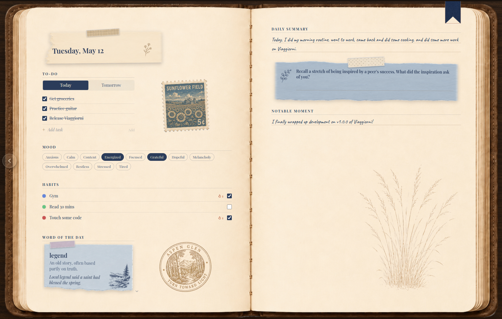
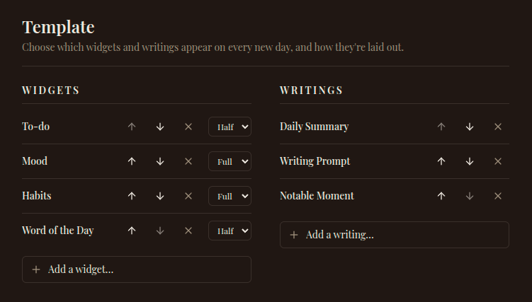
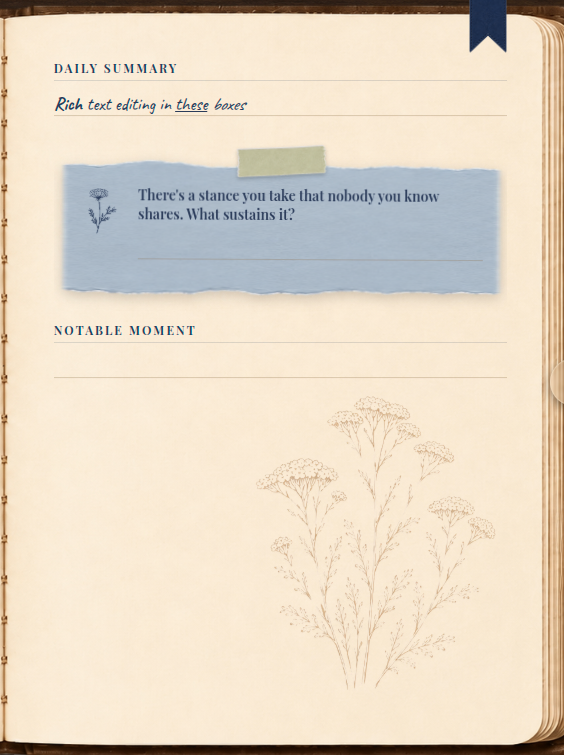
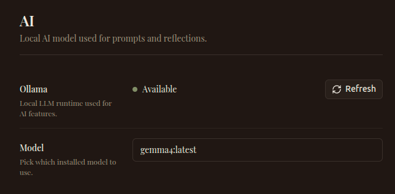
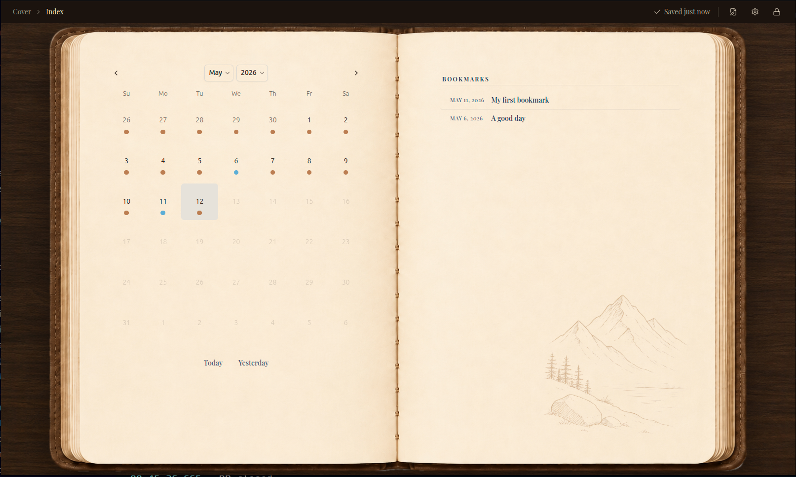

<div align="center">

# Viaggiorni

**A private, encrypted desktop journal that feels like a real notebook.**
Local-first. Privacy-centric. No accounts. No tracking.


<br/>

[](https://github.com/giovannistagnaro/viaggiorni/releases/latest)
[](https://github.com/giovannistagnaro/viaggiorni/actions)


[Download](#install) · [Features](#features) · [Engineering notes](#engineering-notes) · [Build from source](#build-from-source)

</div>

---

## Why I built this

I wanted a journal that felt like the paper one on my desk, but with the things only software can offer: secure storage, habit streaks, a real calendar. Every app I tried wanted an account, a subscription, or a server. So I built Viaggiorni: a desktop journal where the database lives on your machine, the file is encrypted, and nothing leaves unless you export it yourself.

The design north star was _cozy, trustworthy, and genuinely useful_. Not corporate, not generic.

---

## Highlights

- **Encrypted by default.** SQLCipher-encrypted database, AES-encrypted photos, password-derived key (PBKDF2). Nothing stored in plaintext.
- **Local-only.** No accounts, no telemetry, no network calls, except optionally to your own machine for AI.
- **Build your own page.** A template editor lets you choose which widgets and writing sections appear on every new day.
- **Local AI, optional.** Bring your own [Ollama](https://ollama.com) model for writing prompts and a daily word of the day. Sensible fallbacks if you don't run Ollama.
- **A real notebook feel.** Two-page spreads, bookmarks, vintage paper textures, hand-cut stamps and stencils for decoration.
- **Cross-platform.** macOS, Windows, Linux, built from the same source via CI.

---

## Features

### Local-first and fully encrypted


One app-level password set on first launch. Used to derive a key (PBKDF2) that encrypts the entire SQLite database via SQLCipher. Photos are stored as separately AES-encrypted files on disk. The password is never stored. Lock the app any time with **Ctrl/Cmd+L**.

### A daily page you actually want to open


Each day is a two-page spread. The left page holds your widgets; the right page holds your writings. Choose what shows up via the template editor.

### Widgets — track the things that matter to you



- **Habit tracker** — checkboxes with colored dots and streak counters, with pause logic for vacations or sick days.
- **To-do** — today/tomorrow toggle, add and reorder, ticked items move out of the way.
- **Mood** — your own tags, multi-select per day.
- **Photos** — encrypted on disk, carousel with scrapbook-style photo corners.
- **Word of the day** — local fallback list, or generated by your Ollama model.

### Writings — guided and free-form



Rich text via TipTap. Pick from built-in sections — _daily summary_, _gratitude_, _notable moment_, _writing prompt_. Mix and match in any order via the template.

### Local AI with Ollama (optional)



If Ollama is running on `localhost:11434`, Viaggiorni detects it on launch and lets you pick any pulled model. AI is used for two opt-in features: generating a writing prompt for the day and generating a word of the day. If Ollama isn't there, both features fall back to a curated local list; the app never tries to reach an external server.

### Calendar index + bookmarks



The index is a two-page spread: a month calendar with dot indicators on days you've written, and a bookmarks list of any entries you've dog-eared. Click a day, click a bookmark, jump to it.

### Custom visual assets — stamps, stencils, decorations


A library of stamps, stencils, and decorative elements that fill designated spots on each page, with the specific piece picked at random from the bundled set so no two pages look quite the same. Each one starts as generated artwork, then runs through a custom Python background-removal pipeline that cleanly isolates the element from its source. The whole library ships with the app, so decoration works fully offline.

### Encrypted import/export

Export your entire journal (entries, widgets, photos, settings) as a single encrypted backup file. Import on a new machine with your password. Nothing else needed.

### Built for the keyboard

| Shortcut             | Action                 |
| -------------------- | ---------------------- |
| `Ctrl/Cmd + ,`       | Open settings          |
| `Ctrl/Cmd + B`       | Bookmark current entry |
| `Ctrl/Cmd + L`       | Lock app               |
| `Ctrl/Cmd + ←` / `→` | Previous / next day    |
| `Esc`                | Back / close dialog    |

Breadcrumb navigation across the top of every screen (_Cover › Index › May 12_) makes it easy to drop in, write, and get out.

---

## Install

> Latest installers are published on the [Releases page](https://github.com/giovannistagnaro/viaggiorni/releases/latest).

### macOS

Download `viaggiorni-<version>.dmg` from the [Releases page](https://github.com/giovannistagnaro/viaggiorni/releases/latest).

1. Open the `.dmg` and drag **Viaggiorni** into your **Applications** folder.
2. Double-click Viaggiorni. macOS will show _"Viaggiorni" Not Opened_ — click **Done**.
3. Open **System Settings → Privacy & Security**, scroll to the **Security** section, click **Open Anyway** next to the Viaggiorni notice, then **Verify** → **Ignore**.
4. Open Terminal and run:
   ```bash
   xattr -cr /Applications/Viaggiorni.app
   codesign --force --deep --sign - /Applications/Viaggiorni.app
   ```
5. Open Viaggiorni from Applications. It will launch normally from this point on.

### Windows

Download `viaggiorni-<version>.msi` from the [Releases page](https://github.com/giovannistagnaro/viaggiorni/releases/latest).

1. Run the `.msi`. If Windows prompts that the file is an executable, click **OK**.
2. Windows SmartScreen will show _Windows protected your PC_ — click **More info → Run anyway**.
3. After install, launch Viaggiorni from the Start menu like any other app.

### Linux

#### `.deb` (recommended for Debian/Ubuntu)

```bash
sudo dpkg -i ~/Downloads/viaggiorni_*.deb
```

Launch from your applications menu or run `viaggiorni`.

#### `.AppImage`

```bash
chmod a+x ~/Downloads/viaggiorni-*.AppImage
~/Downloads/viaggiorni-*.AppImage --no-sandbox
```

---

## First time using Viaggiorni

1. **Set a password.** It encrypts your database; remember there is no recovery if you lose it. Pick something you'll remember.
2. **Pick a name.** Used in the daily greeting; you can change it later.
3. **(Optional) Connect Ollama.** Install [Ollama](https://ollama.com), pull a model (`ollama pull llama3.2`), start the process (`ollama serve`), and select it in Settings → AI.
4. **Customize your template.** Template Editor lets you choose which widgets and writings appear on every new day.

---

## Your data

### Where it lives

Viaggiorni stores everything in your OS's standard app-data directory:

| OS      | Location                                    |
| ------- | ------------------------------------------- |
| macOS   | `~/Library/Application Support/Viaggiorni/` |
| Windows | `%APPDATA%\Viaggiorni\`                     |
| Linux   | `~/.config/Viaggiorni/`                     |

That folder contains the encrypted SQLite database, metadata, and the encrypted photo files. Nothing else, anywhere.

### Deleting your data

1. Quit Viaggiorni.
2. Delete the folder above.
3. (Optional) Uninstall the app via your OS's normal uninstall process.

That's the whole footprint. There is nothing on a server, because there is no server.

### Backups

Settings → Backup → **Export** produces a single encrypted file. **Import** restores it on any machine with your password. Keep this file somewhere safe; treat it like the original.

---

## Engineering notes

A short tour of the things I'm proud of, for anyone reading the code.

### Quality and process

- **604 unit tests** with Vitest + React Testing Library, covering main-process queries, IPC handlers, and renderer components.
- **GitHub Actions CI** runs typecheck, lint, and the full test suite on every push.
- **Automated multi-platform releases.** Tagging `v*` triggers a workflow that builds installers on Linux, Windows, and macOS runners and attaches them to a GitHub Release.
- **End-to-end type safety.** TypeScript types are inferred directly from the Drizzle schema and shared across main, preload, and renderer — no hand-maintained DTOs, no drift.
- Conventional-commit history with focused, atomic commits. `git log` reads like a changelog.

### Security

- **SQLCipher** via `better-sqlite3-multiple-ciphers` encrypts the entire database at rest.
- **PBKDF2** key derivation from the user's password — the password itself is never stored.
- **AES-encrypted photos** stored as separate files outside the database for efficient streaming.
- **Strict contextBridge isolation** between renderer and Node — the renderer only sees a typed, narrow API surface.
- **No telemetry, no remote calls.** The only network the app can touch is `localhost:11434` for Ollama, and only if you've turned it on.

### Architecture

```
src/
├── main/          Electron main process — DB queries, IPC handlers, encryption, file I/O
│   ├── db/        Drizzle schema, migrations, query modules per domain
│   └── ipc/       IPC handlers — one module per feature
├── preload/       contextBridge — exposes typed APIs to the renderer
├── renderer/      React 19 + Tailwind v4 frontend
└── shared/        Types inferred from the Drizzle schema, shared everywhere
```

The renderer never imports from `main/`. All cross-boundary traffic goes through preload over IPC, which means the entire main process can be unit-tested in Node without spinning up Electron.

### Stack

React 19 · TypeScript 5 · Vite · Tailwind v4 · shadcn/ui · TipTap · Electron 39 · `better-sqlite3-multiple-ciphers` (SQLCipher) · Drizzle ORM · Vitest · Ollama

---

## Build from source

```bash
git clone https://github.com/giovannistagnaro/viaggiorni.git
cd viaggiorni
npm install
npm run dev          # run the app in development
npm test             # run the test suite
npm run typecheck    # full typecheck (node + web)
npm run lint
```

To produce installers locally:

```bash
npm run build:mac    # → dist/*.dmg
npm run build:win    # → dist/*.msi
npm run build:linux  # → dist/*.AppImage and dist/*.deb
```

---

<div align="center">

Built by **Giovanni Stagnaro** — [website](https://giovannistagnaro.com/) · [linkedin](https://www.linkedin.com/in/giovanni-stagnaro/)

</div>
